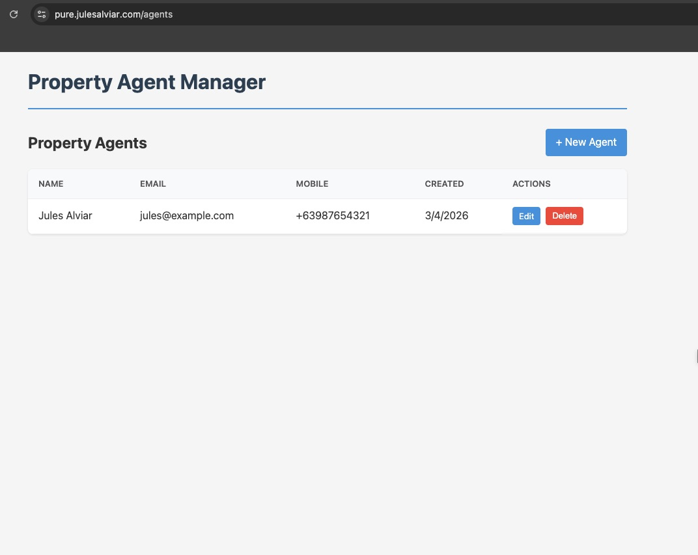
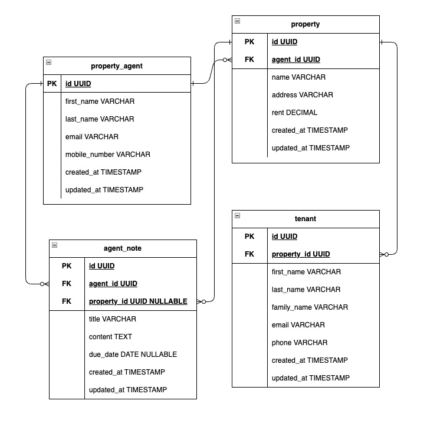

# Pure

A full-stack **Property Agent Manager** application for managing real estate agents. Built with Vue 3 and Express.

> Take-home exercise for **PURE Home River**

## Overview

This application lets you manage property agents and their contact details through a simple, responsive interface. Data is stored in memory for development and demo purposes.

Pure is a monorepo containing:

- **Client** — Vue 3 + Vite frontend with Vue Router
- **API** — Express REST API with in-memory storage

### Demo

**[Live Demo](https://pure.julesalviar.com)** — [https://pure.julesalviar.com](https://pure.julesalviar.com)



### Features

- **List agents** — View all property agents in a table
- **Create agent** — Add new agents with first name, last name, email, and mobile number
- **Edit agent** — Update existing agent details
- **Delete agent** — Remove agents with confirmation
- **Validation** — Required fields and unique email enforcement

### Tech Stack

| Layer   | Technologies                          |
| ------- | ------------------------------------- |
| Frontend | Vue 3, Vite 7, Vue Router, TypeScript |
| Backend  | Express, CORS, UUID, TypeScript       |

## Project Structure

```
pure/
├── client/          # Vue 3 frontend
│   └── src/
│       ├── views/   # AgentList, AgentForm
│       ├── services/ # agentApi
│       └── types/   # PropertyAgent
├── api/             # Express backend
│   └── src/
│       ├── routes/  # agentRoutes
│       ├── models/  # PropertyAgent, store
│       └── middleware/ # validate
└── package.json     # Root scripts
```

## Entity-Relationship Diagram

The database schema defines four entities: property agents, properties, agent notes, and tenants. Agents manage properties and create notes; properties can be linked to tenants.



## Project Setup

```sh
npm install
```

This installs dependencies for both client and API.

## Development

Run both client and API in parallel:

```sh
npm run dev
```

- **Client** — Vite dev server (typically http://localhost:5173)
- **API** — Express server at http://localhost:3000

Or run them separately:

```sh
npm run dev:client   # Frontend only
npm run dev:api      # API only
```

## Production

### Build

```sh
npm run build
```

Builds both client and API.

### Preview Client

```sh
npm run preview
```

### Start API

```sh
npm run start:api
```

### Deployment

The live demo is deployed as follows:

| Component | Platform |
| --------- | -------- |
| Frontend  | [Cloudflare Pages](https://pages.cloudflare.com/) |
| Backend   | [GCP Cloud Run](https://cloud.google.com/run) + [Cloud Build](https://cloud.google.com/build) |

## API Endpoints

| Method | Endpoint        | Description          |
| ------ | --------------- | -------------------- |
| GET    | `/api/agents`    | List all agents      |
| GET    | `/api/agents/:id`| Get single agent     |
| POST   | `/api/agents`    | Create agent         |
| PUT    | `/api/agents/:id`| Update agent         |
| DELETE | `/api/agents/:id`| Delete agent         |
| GET    | `/api/health`    | Health check         |

## Configuration

- **API base URL** — Set `VITE_AGENT_API_BASE_URL` in the client environment to override the default `http://localhost:3000/api/agents`.

## Recommended IDE Setup

[VS Code](https://code.visualstudio.com/) + [Vue (Official)](https://marketplace.visualstudio.com/items?itemName=Vue.volar) (and disable Vetur).

## Recommended Browser Setup

- **Chromium-based** (Chrome, Edge, Brave): [Vue.js devtools](https://chromewebstore.google.com/detail/vuejs-devtools/nhdogjmejiglipccpnnnanhbledajbpd)
- **Firefox**: [Vue.js devtools](https://addons.mozilla.org/en-US/firefox/addon/vue-js-devtools/)
